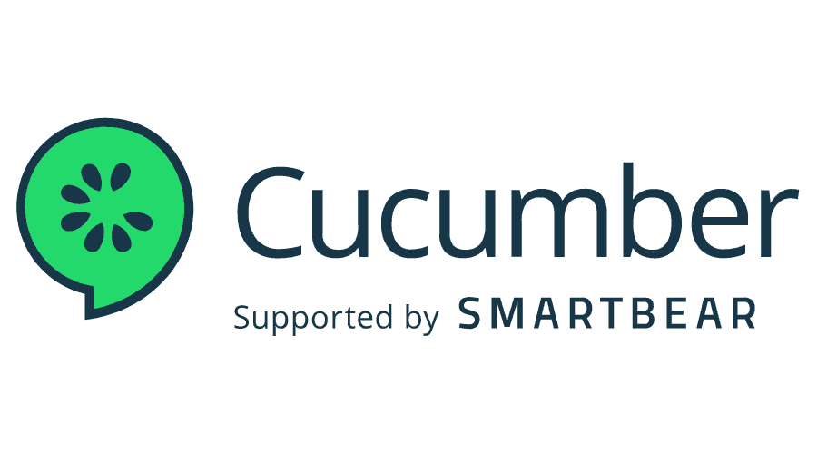

# INDEX
- [PROJECT DESCRIPTION](#project-description)
- [TEST APPROACH](#test-approach)
  - [TEST LEVELS](#test-levels)
    - [UNIT TESTING](#unit-testing)
    - [In]

- [TEST MANAGEMENT](#test-management)
- [AGILE METRICS](#agile-metrics)
- [DEFECT MANAGEMENT](#defect-management)

# PROJECT DESCRIPTION

Lorem Ipsum is simply dummy text of the printing and typesetting industry. Lorem Ipsum has been the industry's standard dummy text ever since the 1500s, when an unknown printer took a galley of type and scrambled it to make a type specimen book. It has survived not only five centuries, but also the leap into electronic typesetting, remaining essentially unchanged. It was popularised in the 1960s with the release of Letraset sheets containing Lorem Ipsum passages, and more recently with desktop publishing software like Aldus PageMaker including versions of Lorem Ipsum.

Tools used
: JIRA | IntelliJ | Postman | Selenium | Cucumber | AxeDev | 

  
 

  
  
  

# TEST APPROACH

## TEST LEVELS

### Unit testing
[UI Component Test Suit](https://techdojob2.atlassian.net/projects/QTC?selectedItem=com.atlassian.plugins.atlassian-connect-plugin:com.kanoah.test-manager__main-project-page#!/v2/testCases?projectId=10003)

Lorem Ipsum is simply dummy text of the printing and typesetting industry. Lorem Ipsum has been the industry's standard dummy text ever since the 1500s, when an unknown printer took a galley of type and scrambled it to make a type specimen book. It has survived not only five centuries, but also the leap into electronic typesetting, remaining essentially unchanged. It was popularised in the 1960s with the release of Letraset sheets containing Lorem Ipsum passages, and more recently with desktop publishing software like Aldus PageMaker including versions of Lorem Ipsum.

### Integration testing
Lorem Ipsum is simply dummy text of the printing and typesetting industry. Lorem Ipsum has been the industry's standard dummy text ever since the 1500s, when an unknown printer took a galley of type and scrambled it to make a type specimen book. It has survived not only five centuries, but also the leap into electronic typesetting, remaining essentially unchanged. It was popularised in the 1960s with the release of Letraset sheets containing Lorem Ipsum passages, and more recently with desktop publishing software like Aldus PageMaker including versions of Lorem Ipsum.

### System testing
Lorem Ipsum is simply dummy text of the printing and typesetting industry. Lorem Ipsum has been the industry's standard dummy text ever since the 1500s, when an unknown printer took a galley of type and scrambled it to make a type specimen book. It has survived not only five centuries, but also the leap into electronic typesetting, remaining essentially unchanged. It was popularised in the 1960s with the release of Letraset sheets containing Lorem Ipsum passages, and more recently with desktop publishing software like Aldus PageMaker including versions of Lorem Ipsum.

### Acceptance testing
Lorem Ipsum is simply dummy text of the printing and typesetting industry. Lorem Ipsum has been the industry's standard dummy text ever since the 1500s, when an unknown printer took a galley of type and scrambled it to make a type specimen book. It has survived not only five centuries, but also the leap into electronic typesetting, remaining essentially unchanged. It was popularised in the 1960s with the release of Letraset sheets containing Lorem Ipsum passages, and more recently with desktop publishing software like Aldus PageMaker including versions of Lorem Ipsum.

## Test Types
### Black Box
#### Functional 
#### Non-functional

### White Box

# TEST MANAGEMENT

## JIRA & Zephyr scale

## Test Plans
### Sprint 1

#### Test Artifacts
[UI Component Test Suit](https://techdojob2.atlassian.net/projects/QTC?selectedItem=com.atlassian.plugins.atlassian-connect-plugin:com.kanoah.test-manager__main-project-page#!/v2/testCases?projectId=10003)

[**Income Tax Calculation-UI**-Test analysis and design](https://docs.google.com/document/d/1RmNcYZimInADYbaS5WCcUtNw1NeDR47olZXLoImyVE8/edit)

# AGILE METRICS

# DEFECT MANAGEMENT

# TEST EXIT REPORT
